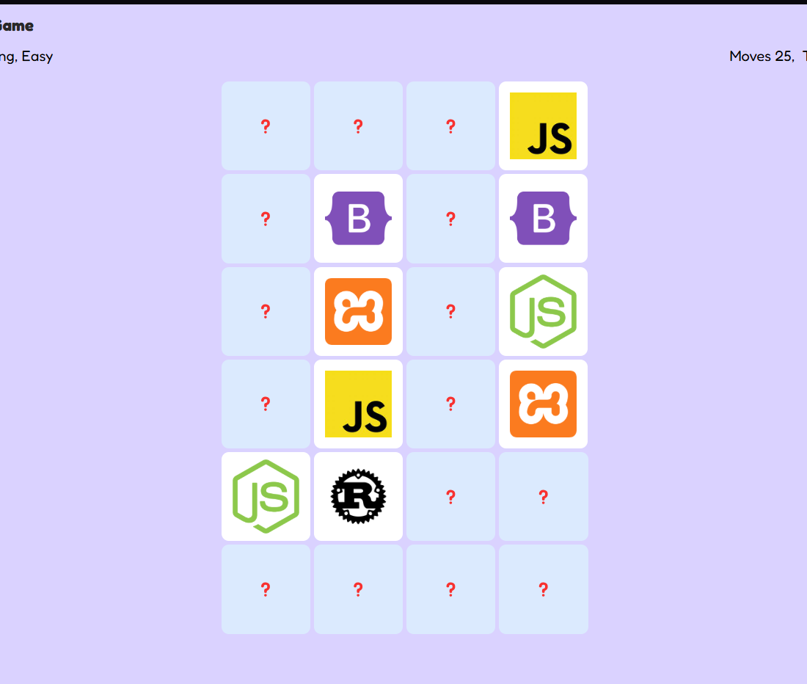
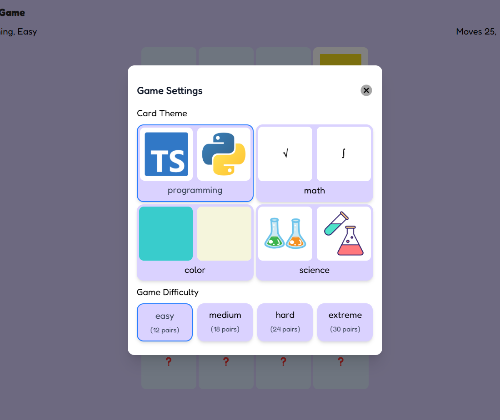

## Memory Game
This game will Train Short Term Memory, Improve Concentration and Focus, and Train Visual Memory - [`preview`](https://memory-game-kiel.vercel.app).

## Key Feature
- **Game Settings:** Players can choose cards theme(programming, math, science, colors) and set difficulty
- **Performance Tracking:** Players can track their completion time and total moves to measure and improve their performance over time.
- **Responsive Design:** Good display on both desktop and mobile

## Screenshots
<table>
  <tr>
    <td align="center">
      
       
      <em>Game(easy mode)</em>
    </td>
    <td align="center">
      
       
      <em>Settings</em>
    </td>
  </tr>
</table>

## Teknology Used
- Next JS
- Tailwind CSS